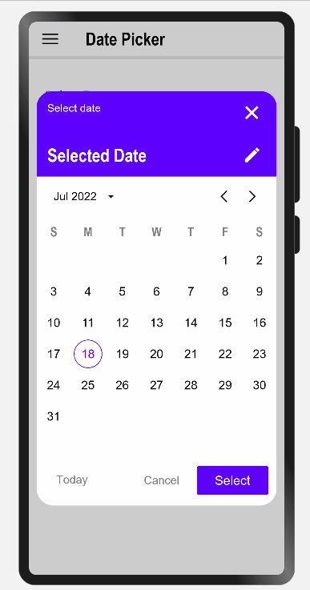
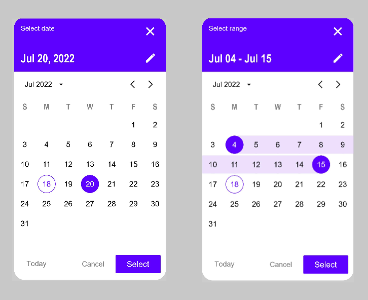
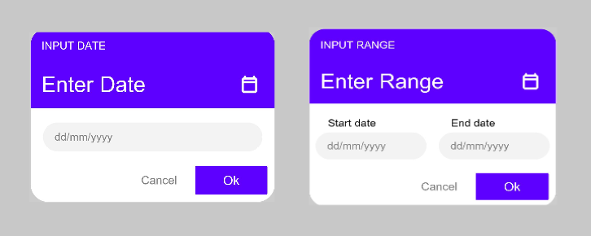
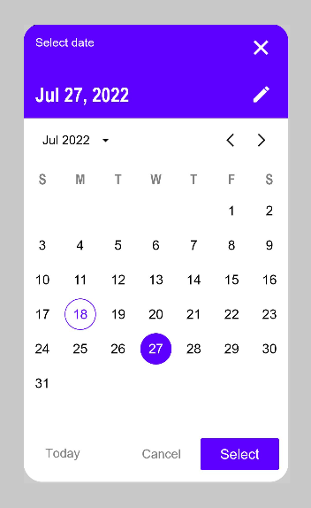
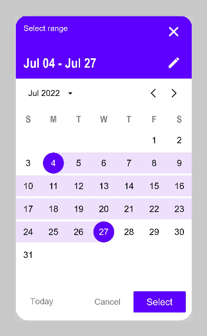
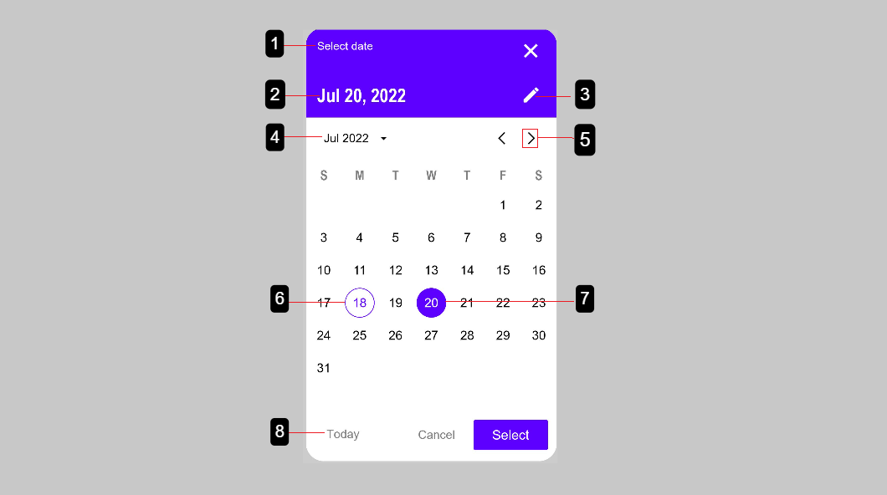

# Date Picker
Date pickers let users select a date or range of dates.



## Download & Install
Install using npm

```npm i @ohos/materialDatePicker```

Details about OpenHarmony NPM environment configuration, see at [here](https://gitee.com/openharmony-tpc/docs/blob/master/OpenHarmony_npm_usage.md)


## Usage instructions
1. Add dependencies

For using MaterialDatePicker in your app, add the below dependency in the entry/package.json  
```
"dependencies": {
    "@ohos/materialDatePicker": "file:../MaterialDatePicker"
  }
```

2. Handle imports

Import these components and data types
```
import { MaterialDatePicker, CalendarType, PickerType } from '@ohos/materialDatePicker'
```

3. Code for creating DatePickerDialog
```
MaterialDatePicker({
      confirm: (value) => this.onAccept(value),
      cancel: this.exitApp,
      options: {
        picker: PickerType.DATE_PICKER,
        inputMode: CalendarType.SELECT_DATE,
        startYear: 2000,
        endYear: 2030,
        openAtYear: 2022,
        openAtMonth: 6,
        themeColor: 0x5e00ff,
        titleStyle: {
          textLabel: "Select date",
          textColor: Color.White
        },
        selectedDateStyle: {
          textColor: Color.White
        },
        monthStyle: {
          itemFillColor: 0x5e00ff
        },
        cancelButtonStyle: {
          textColor: Color.Grey
        },
        confirmButtonStyle: {
          textColor: Color.White,
          itemFillColor: 0x5e00ff
        }
      }
    }),
    cancel: this.exitApp,
    autoCancel: true,
    alignment: DialogAlignment.Center,
})
```


## Usage
The following image shows a date picker and a range date picker in different modes:

1. _SELECT_MODE_




2. _INPUT_MODE_



### Date picker
Calendar date pickers can be used to select dates in the near future or past, when it’s useful to see them in a calendar month format. They are displayed in a dialog.
Common use cases include:
Making a restaurant reservation
Scheduling a meeting

#### Date picker example

The following example shows a date picker with a date selected.



In code:

1. SELECT_MODE
```
MaterialDatePicker({
      ...
      options: {
        picker: PickerType.DATE_PICKER,
        inputMode: CalendarType.SELECT_DATE,
      ...
      }
})        
```

2. INPUT_MODE
```
MaterialDatePicker({
      ...
      options: {
        picker: PickerType.DATE_PICKER,
        inputMode: CalendarType.ENTER_DATE,
      ...
      }
})        
```

### Date range pickers
Mobile date range pickers allow selection of a range of dates.
Common use cases include:
Booking a flight
Reserving a hotel

#### Date range picker example

The following example shows a date range picker with a date range selected.



In code:
1. SELECT_MODE
```
MaterialDatePicker({
      ...
      options: {
        picker: PickerType.DATE_RANGE_PICKER,
        inputMode: CalendarType.SELECT_DATE,
      ...
      }
})        
```

2. INPUT_MODE
```
MaterialDatePicker({
      ...
      options: {
        picker: PickerType.DATE_RANGE_PICKER,
        inputMode: CalendarType.ENTER_DATE,
      ...
      }
})        
```

## Anatomy and key properties

The following diagram shows the elements of a date picker:



1. Title
2. Selected date
3. Switch-to-keyboard input icon
4. Year selection menu
5. Month pagination
6. Current date
7. Selected date
8. Go to today-date button


## Attributes
You can customize the date picker using these attributes:

| Attribute  | Description  |
| ------------ | ------------ |
| picker | sets the type of picker|
| inputMode | sets the input mode |
| startYear | sets the starting year of the calendar|
| endYear | sets the end year of the calendar|
| openAtYear | sets the opening year of the calendar|
| openAtMonth | sets the opening month of the calendar|
| themeColor | sets the main theme color of the date picker|
| titleStyle: textLabel | sets the title text|
| titleStyle: textColor | sets the font color of title text|   
| selectedDateStyle: textColor | sets the font color of selected date|
| monthStyle: textColor | sets the font color of dates|
| monthStyle: todayDateTextColor | sets the font color of today's date|
| monthStyle: todayDateBorderWidth | sets the border width of today's date|
| monthStyle: todayDateBorderColor | sets the border  color of today's date |
| monthStyle: todayDateFillColor | sets the fill color of today's date|
| monthStyle: itemFillColor | sets the fill color of selected date|
| monthStyle: rangeFillColor | sets the fill color of selected range|
| cancelButtonStyle: textColor | sets the font color of cancel button|
| confirmButtonStyle: textColor | sets the font color of confirm button|
| confirmButtonStyle: itemFillColor | sets the fill color of confirm button| 


## Directory Structure
```
|---- MaterialDatePicker (Project Name)
|     |---- MaterialDatePicker (Date Picker Library)
|           |---- src
|                 |---- main
|                       |---- ets
|                             |---- components
|                                   |---- CalendarDay.ets
|                                   |---- DatePickerInput.ets
|                                   |---- DatePickerSelect.ets
|                                   |---- DatePickerModel.ets
|                                   |---- MaterialDatePicker.ets
|                                   |---- MonthCalendar.ets
|                                   |---- Types.ets
|                                   |---- Values.ets
|                                   |---- YearSelectGrid.ets
|                                  
|           |---- index.ets
|
|     |---- entry
|           |---- src
|                 |---- main
|                       |---- ets
|                             |----pages
|                                   |---- index.ets

```

## Compatibility
Supports OpenHarmony API version 9


## Code Contribution
If you find any problems during usage, you can submit an [issue](https://github.com/Applib-OpenHarmony/MaterialDatePicker/issues) to us. Of course, we also welcome you to send us PR.


## Open source License
This project is based on [Apache License 2.0](./LICENSE), please enjoy and participate in open source freely.
